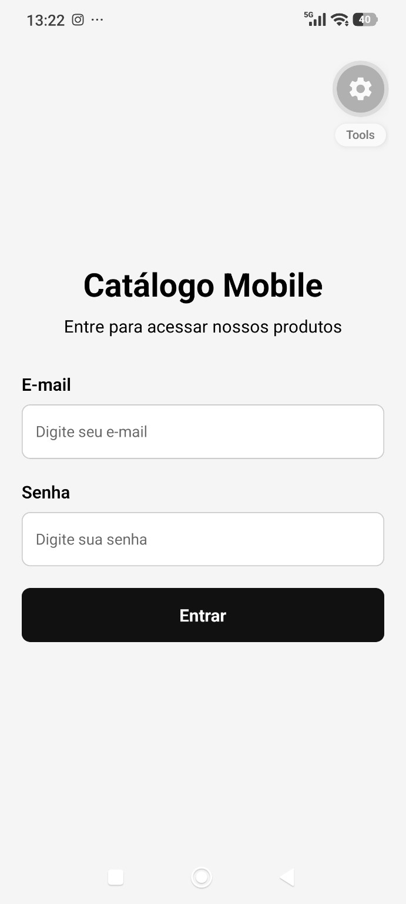
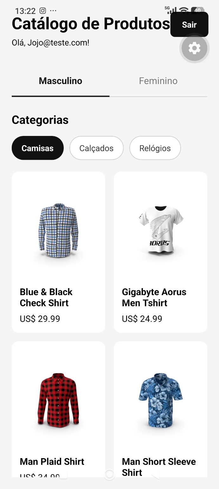
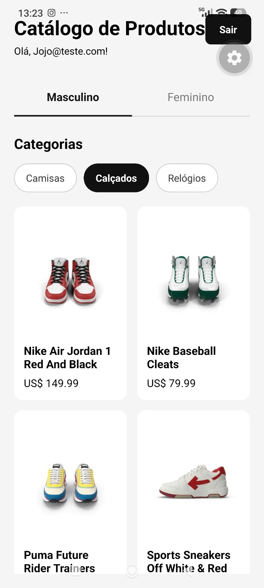
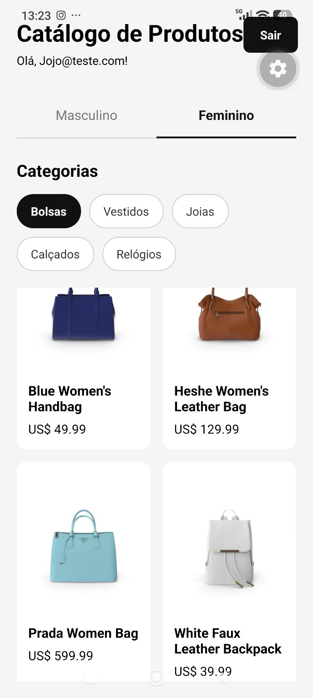
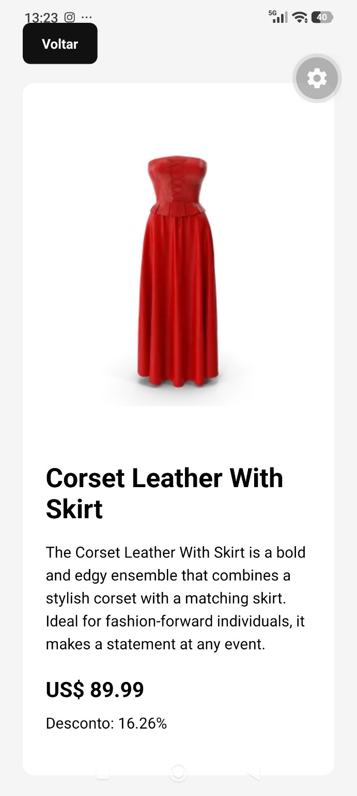

Catálogo Mobile

Aplicativo mobile desenvolvido em React Native com Expo para exibição de
produtos organizados por categorias masculinas e femininas.

O projeto consome dados da API DummyJSON utilizando Axios e possui
navegação entre telas com Expo Router, gerenciamento de estado global
com Redux Toolkit e interface responsiva para dispositivos móveis.

Funcionalidades

Tela de login com validação de campos

Armazenamento temporário do usuário com Redux Toolkit

Logout funcional com limpeza dos dados armazenados

Separação de produtos por abas Masculino e Feminino

Categorias masculinas: Camisas, Calçados e Relógios

Categorias femininas: Bolsas, Vestidos, Joias, Calçados e Relógios

Consumo da API DummyJSON com Axios

Indicador de carregamento durante as requisições

Tratamento de erros nas chamadas da API

Listagem de produtos utilizando FlatList

Tela de detalhes do produto

Exibição de imagem, nome, descrição, preço e percentual de desconto

Navegação dinâmica utilizando o ID do produto

Proteção da tela de catálogo para usuários não autenticados

Tecnologias utilizadas

React Native

Expo

TypeScript

Expo Router

Axios

Redux Toolkit

React Redux

DummyJSON API

Estrutura principal do projeto

src/
├── app/
│   ├── _layout.tsx
│   ├── index.tsx
│   ├── catalogo.tsx
│   └── produto/
│       └── [id].tsx
├── services/
│   └── api.ts
└── store/
    ├── store.ts
    └── userSlice.ts

Descrição dos principais arquivos

src/app/index.tsx: tela de login e validação dos campos.

src/app/catalogo.tsx: listagem de produtos, categorias, abas e
logout.

src/app/produto/[id].tsx: tela de detalhes do produto utilizando
rota dinâmica.

src/app/_layout.tsx: configuração das rotas da aplicação.

src/services/api.ts: configuração do Axios para consumo da
DummyJSON.

src/store/store.ts: configuração da store global do Redux.

src/store/userSlice.ts: gerenciamento dos dados do usuário e das
ações de login/logout.

API utilizada

O projeto utiliza a API pública DummyJSON.

Endpoint base:

https://dummyjson.com

Exemplo de busca por categoria:

GET /products/category/mens-shirts

Exemplo de busca de produto pelo ID:

GET /products/83

Como executar o projeto

Pré-requisitos

Node.js

npm

Expo Go no dispositivo móvel, caso queira executar no celular

Instalação

Clone o repositório:

git clone https://github.com/medivalmad/catalogo-mobile.git

Entre na pasta:

cd catalogo-mobile

Instale as dependências:

npm install

Inicie:

npx expo start

Após iniciar, é possível escanear o QR Code com o Expo Go, executar no
Android ou abrir a versão web.

Fluxo da aplicação

Login
  ↓
Validação dos campos
  ↓
Redux armazena o usuário
  ↓
Catálogo
  ↓
Masculino / Feminino
  ↓
Categorias
  ↓
Axios consulta a DummyJSON
  ↓
Lista de produtos
  ↓
Produto selecionado
  ↓
Tela de detalhes

Gerenciamento de estado

O Redux Toolkit é utilizado para armazenar temporariamente os dados do
usuário.

No login:

logged = true
email = usuário informado

No logout:

logged = false
email = ""

O estado também é utilizado para impedir o acesso ao catálogo quando o
usuário não está autenticado.

Tratamento de carregamento e erros

Durante as requisições à API, o aplicativo utiliza ActivityIndicator
para indicar o carregamento.

Caso ocorra algum erro na comunicação com a API, uma mensagem é
apresentada ao usuário.

Navegação

A navegação é realizada utilizando Expo Router.

/ --- tela de login

/catalogo --- tela principal do catálogo

/produto/[id] --- tela dinâmica de detalhes do produto

## 📱 Prints do projeto

### Login

  

### Catálogo

  
  

  

### Detalhes do produto

  

## 👨‍💻 Autor

## 📄 Relatório Prático

O relatório prático do projeto contém os principais registros das funcionalidades implementadas e prints do aplicativo em funcionamento.

[Visualizar Relatório Prático](docs/Relatorio_Pratico_Catalogo_Mobile_FINAL.pdf)

João Pedro Lemos de Oliveira

Projeto desenvolvido para a disciplina de Mobile Development.